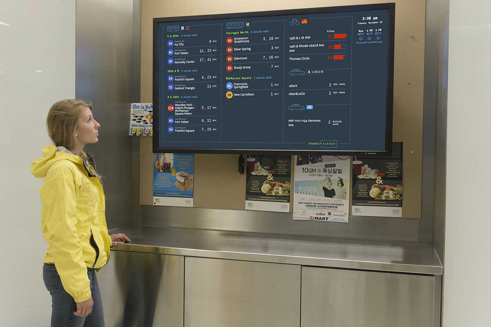
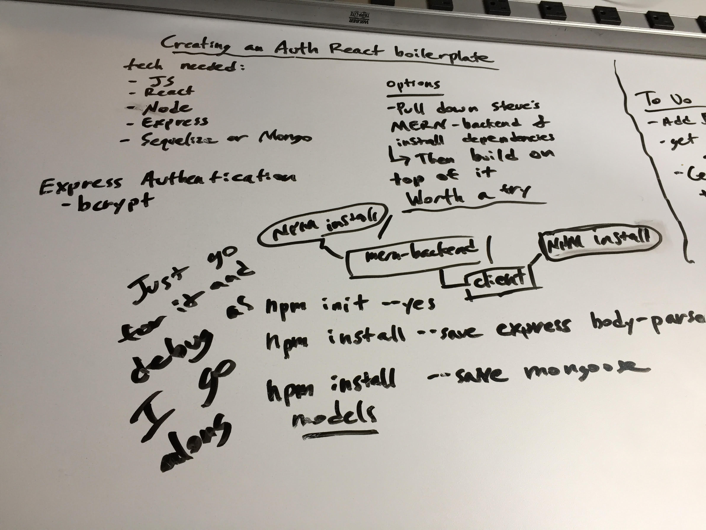
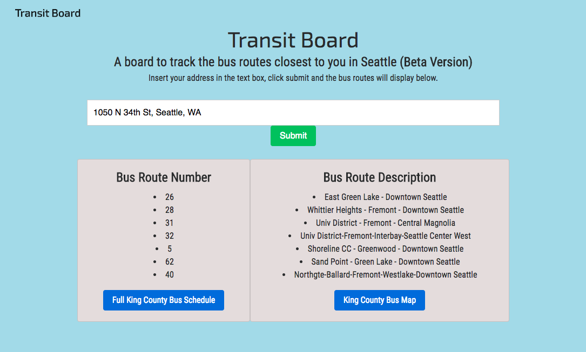

# transportation-board

## How I Thought of the idea

I am fascinated with transportation and its complex systems in urban areas. I recently saw a 'transit screen' at an apartment in Seattle and wanted to see if I could make my own. 

## Planning 

I first begun by doing wireframes in my notebook which consisted of a title, a text box where someone would input their address, and below it four boxes for differnet apis to be called. It was only a single page app, meant to be used in a similar way to the transit screen picutured above. My long term idea is to create a rasperry pi IOT project out of it. I then took this sketch and proceeded to use a white board and map it out.

For this project we only had a week to work on it, compared to our other projects where we had nine, so I tried to keep it simple. 

## Technonolgies Used 
- Javascript 
- React 
- jQuery 
- OneBusAway (King County metro API)
- Google Maps Api 
- MongoDB
- Bootstrap 

## The Process 
I first begun by creating my boostrap framework with my navbar and search box and then proceeded to begin to use the OneBusAway Api. I initally tried my API call from the front end as I had succesfully done in previous projects, however, I came to learn that this API call does not give access unless it's done from the backend. My next stalling point was trying to implement a fetch call to get data from the API, and after much trouble eventurally resorted to doing using an Axios call. 
    
The following day I talked with my professor and decided to restart my project with a auth boilerplate to allow for Log in / Log out functionality. I used MongoDB to store user data and made sure the passwords were hashed. I then returned to trying to get my api call to work. Eventually I was able to store into seperate variables and have it displayed. 
    
However, I had inputed the lattitude and longitude in manually rather than having the search function do that. This became my biggest challenge of the project. In order to achieve the design I wanted I realized I had to use the google places api call on the front end to allow a user to put in an address. Once they clicked submit it would need to be converted to longitude and lattiude and sent to the back end to be placed in the api call. 

This took a great deal of my time, but it was crucial for the functionality of my project. I knew once I got it working it would give me a solid foundation to build on top of because I want to continue to work on this. 

## What I Would've Done Differently 

I knew going into this project that it would be a learning experience for me. I knew I was taking on more than I had done in previous projects in terms of complexity working with various apis. That being said, I would've planned it out better and also would've done the Google api call first. I went into it thinking I could do them all on the front end and pass the lat and long through a stored variable. This obviously proved false. 

##  Going forward 

I plan on adding a few more apis to this project to improve its functionality and heighten my understanding of transit apis and how they obtain their data. 

